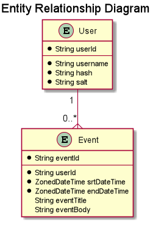

# Project Calendar v3.0

## Introduction

Project Calendar is a REST API that provides a simple Calendar service platform for clients. It's a simple way to create
events and track events to the cloud. User accounts and events can be managed anywhere from any device or client that 
can make HTTP calls.

### Motivation

The motivation behind Project Calendar was to practice the concepts and methodologies of software development learned 
from Bloom Institute of Technologies Backend Program. It is also an opportunity to learn more about the technologies in 
depth such as Spring Boot, Security, or the concepts and uses of Cookies.

A secondary motivation was to develop a solution to a problem that has already been solved (such as a Google Calendar, 
albeit in much limited scope) from scratch to promote problem-solving, refine design skills, and to stimulate 
creativity.

## Design

The Calendar API uses Spring Boot to drive the Java application and the respective endpoints. The overall configurations
of the Spring Boot application have been left in their default states such as the Tomcat Server. HttpOnly Cookies are 
used to authenticate and validate HTTP method calls to the API endpoints when altering User or Event entities using a
type 4 UUID. The UUID is generated during the creation of the User account.

A Calendar is composed of two stateful entities. A User entity which is created by and managed by the client and Event 
entities which are associated with a User which are also created and managed by the client. The features and endpoints 
of the API are based on addressing the user stories below.



### Hypothetical Business Requirements
#### User Stories:
* As a user I want to be able to create a User account
* As a user I want to be able to modify a User account
* As a user I want to be able to delete a User account
* As a user I want to be able to login and logout of a User account
* As a user I want to be able to create Events associated with a User account
* As a user I want to be able to modify Events associated with a User account
* As a user I want to be able to delete Events associated with a User account
* As a user I want to be able to query Events associated with a User account

### HTTP Method Call Examples
#### POST method call in creating a new User Account
```
{
    "username": "example_username"
    "password": "example_password"
}
```

```
{
    "userId": "user:9562d7fb-d50c-4077-bdda-7b9b5292c76e",
    "userDto": {
        "username": "example_username,
        "password": "example_password"
    }
}
```

### Technologies Used
* Docker to containerize and automate the deployment process
* Spring Boot framework to minimize development time and deployment time
* Amazon DynamoDB is used to store the User entities and Event entities
* Amazon ECS-Fargate to host and drive the containerized Spring Boot Application 
* Google Guava CacheLoader to minimize the API response times when authenticating Users and retrieving Events

## Reflection
